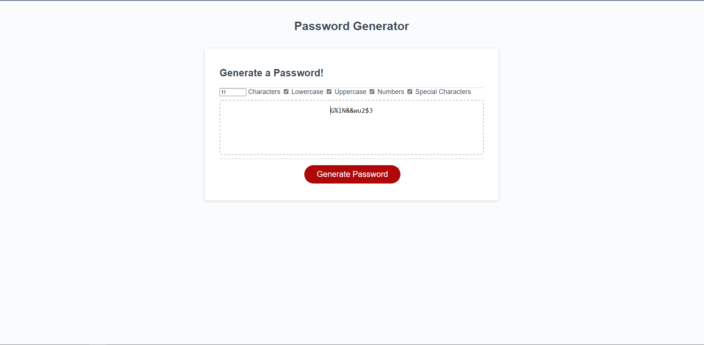

# Password Generator Starter Code
This password generator uses javascript to read the inputs given by the user in provided checkboxes to create a fitting password. There are default settings, which are currently a string length of 8 characters with all character types enabled. Explanation has been provided in the script.js file in the form of comments.

screenshot: 
link to deployed application: 